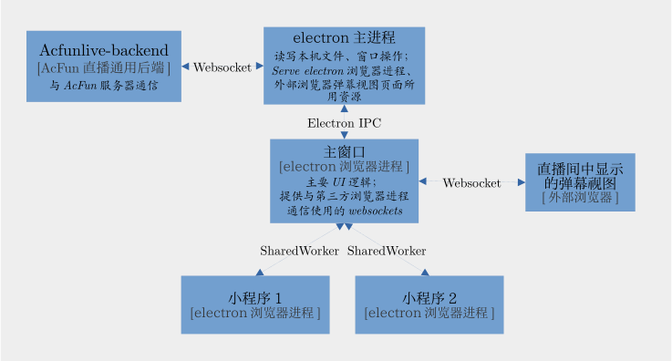

# AcFun Live ToolBox
<div align="center">
  
</div>
<div align="center">
  <span></span>
  &nbsp; &nbsp; &nbsp; &nbsp; &nbsp; &nbsp; &nbsp; &nbsp; 
  &nbsp; &nbsp; &nbsp; 
  <span></span>
</div>
<div align="center">
  
  *An AcFun-FOSS project.*
</div>

## Prerequisite
Node.js LTS latest.

## Setup
### 1. Setup yarn
```sh
# Please switch to node.js lts latest

cd acfunlive-toolbox-client
corepack enable
yarn set version stable
```
### 2. Install dependencies
```sh
yarn install
```

## Run & Debug
### Run the project directly
```sh
yarn run dev
```
### Debug in VSCode or Emacs (dap-mode)


### Debug in other editors
*Windows:*
```sh
node_modules\.bin\electron --remote-debugging-port=9229 .
```
*Unix:*
```sh
node_modules/.bin/electron --remote-debugging-port=9229 .
```
Then attach your debugger to port 9229.

## Directory

```
  ├─┬ electron        == code that run in electron main thread.
  │ ├─┬ main
  │ │ └── index.ts    entry of Electron-Main
  │ └─┬ preload
  │   └── index.ts    entry of Preload-Scripts
  ├─┬ src             == code that run in electron renderer thread.
  │ └── main.ts       entry of Electron-Renderer
  ├── index.html
  ├── package.json
  └── vite.config.ts
```


## FAQ
- [C/C++ addons, Node.js modules - Pre-Bundling](https://github.com/electron-vite/vite-plugin-electron-renderer#dependency-pre-bundling)
- [dependencies vs devDependencies](https://github.com/electron-vite/vite-plugin-electron-renderer#dependencies-vs-devdependencies)
