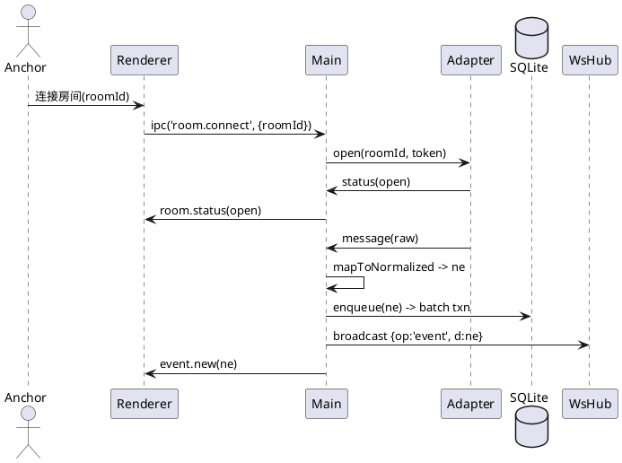
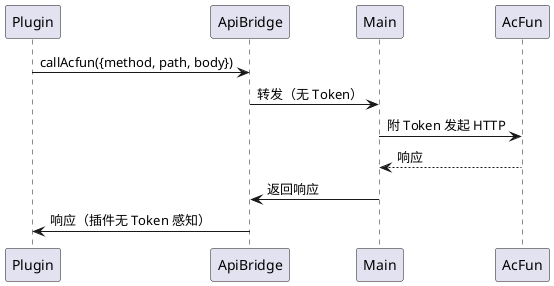

# AcFun Live Manager（Electron）— 详细设计说明书（DDD）

## 0. 目的与范围

* **目的**：在不改变 SRS 目标的前提下，给出**可实现的模块蓝图与接口契约**，确保团队/AI 能按约生成代码并通过验收。
* **范围**：Electron 主进程（集中 WS/持久化/HTTP/WS/插件）、Renderer（A3 UI）、插件运行时（web-first + 可选 Node Worker）、Overlay、诊断与日志、性能与安全基线、测试设计。

---

## 1. 运行时与进程模型

### 1.1 进程/组件

* **Main（Node, Electron 主进程）**：WS 连接与事件标准化；SQLite 队列落盘；Express HTTP/WS；插件生命周期与受控 API；日志/诊断。
* **Renderer（Browser）**：A3 布局壳；wujie 承载插件页面；状态只读面板；少量操作面板。
* **Node Worker（可选，多插件 0..N）**：由主进程托管的后台任务进程，通过 MessagePort 与主进程通信。
* **无独立 DB 进程**：SQLite 由主进程统一管理（WAL）。

### 1.2 事件循环与队列

* 单主线程事件循环 + **专用异步写队列**（批量事务，反压与重试）。
* 所有来自 Adapter/Express/WS 的写入请求**先入队**，避免并发写冲突。
* Renderer/插件的写入均通过 IPC/HTTP 进入主进程排队。

---

## 2. 目录结构（建议）

```
/app
  /main
    bootstrap/        # 启动与依赖守卫、PRAGMA、WAL
    config/           # ConfigManager / SecretsVault / Migration
    adapter/          # 对 acfundanmu.js 的封装与事件映射
    rooms/            # RoomManager（≤3 并发）
    persistence/      # SqlitePool / EventWriter / QueryService / CsvExporter
    server/           # HttpServer / WsHub / routes / middlewares
    plugins/          # PluginManager / ApiBridge / NodeWorkerHost
    overlay/          # OverlayRegistry
    ipc/              # IpcMainHandlers（Renderer 契约）
    logging/          # Log（脱敏）/ Diagnostics（诊断打包）
    types/            # 统一类型（契约）
  /renderer           # A3 布局 & wujie 容器
  /shared             # 可复用的类型声明与工具
  /tests              # 单元/契约/集成/负载/混沌测试
  /scripts            # 打包/检查/lint/CI 脚本
```

---

## 3. 类型与契约（对内/对外统一）

### 3.1 统一事件类型（唯一形状）

```ts
export type NormalizedEventType =
  | 'danmaku' | 'gift' | 'follow' | 'like' | 'enter' | 'system';

export interface NormalizedEvent {
  ts: number;                 // ms since epoch
  room_id: string;
  event_type: NormalizedEventType;
  user_id?: string | null;
  user_name?: string | null;
  content?: string | null;
  raw: unknown;               // 脱敏后的上游原始事件
}
```

### 3.2 房间状态广播

```ts
export type RoomStatus = 'connecting'|'open'|'closing'|'closed'|'reconnecting'|'error';
export interface RoomStatusPayload { roomId: string; status: RoomStatus; reason?: string; retryInMs?: number; }
```

### 3.3 插件受控 API（平台 SDK）

```ts
export interface PluginAPI {
  subscribeEvents(
    filter: { roomId?: string; types?: NormalizedEventType[] },
    cb: (e: NormalizedEvent) => void
  ): () => void;

  callAcfun(req: { method: 'GET'|'POST'|'PUT'|'DELETE'; path: string; body?: any }): Promise<any>;

  pluginStorage: { write(pluginId: string, table: string, row: any): Promise<void>; };

  registerHttpRoute(
    pluginId: string,
    def: { method: 'GET'|'POST'; path: string },
    handlerId: string    // 由平台分配；实际处理在主进程代理
  ): void;
}
```

---

## 4. Adapter（`ACFUN-FOSS/acfundanmu.js` 封装）

### 4.1 目标与原则

* **单一入口**对接 acfundanmu.js；对上暴露稳定 TS 契约。
* **枚举白名单映射**六类事件 → `NormalizedEvent`。
* **连接/重连策略**、**心跳（若必要）**、**错误统一**。
* **许可/版本守卫**：仅允许 `acfundanmu.js`（MIT），拒绝其它库名。

### 4.2 关键接口（伪代码）

```ts
// adapter/AcfunAdapter.ts
export class AcfunAdapter extends TypedEventEmitter<{
  'status': RoomStatus;     // open/...
  'event': NormalizedEvent; // 已映射事件
  'error': AppError;
  'close': { code?: string; reason?: string };
}> {
  private conn?: AcRawConn; // 由 acfundanmu.js 提供的连接对象

  constructor(private opts: { roomId: string; token?: string }) { super(); }

  async open() {
    this.conn = await AcLib.connect({ roomId: this.opts.roomId, token: this.opts.token });
    this.bind(this.conn);
  }

  private bind(c: AcRawConn) {
    c.on('open',  () => this.emit('status', 'open'));
    // 若库直接分发 typed 事件：分别监听后 map；若只给 message：统一 dispatch
    c.on('message', (raw: any) => { const ne = mapToNormalized(this.opts.roomId, raw); if (ne) this.emit('event', ne); });
    c.on('close',  (e: any) => this.emit('close', e));
    c.on('error',  (err: any) => this.emit('error', toAppError(err)));
  }

  async close() { await this.conn?.close(); }
}
```

### 4.3 映射函数 `mapToNormalized`

* **白名单匹配**：上游若有 `danmaku/gift/follow/like/enter/system` 类型或可由字段推断。
* **兜底**：未知类型 → `system`，`raw` 保留脱敏版。
* **字段缺省**：`user_id/user_name/content` 缺失 → `null`（绝不抛错）。
* **脱敏**：删除可能出现的 `authorization/cookie/token` 字段（递归键名匹配）。

### 4.4 重连策略

* 快速重试 5 次：100/200/400/800/1600ms；
* 指数退避：基线\*2，上限 60s；±20% 抖动；状态广播 `reconnecting`；
* 任一房间失败**不影响**其他房间。

---

## 5. RoomManager（≤3 并发）

### 5.1 数据结构与约束

```ts
interface RoomContext {
  id: string;
  adapter: AcfunAdapter;
  primary?: boolean;
  state: RoomStatus;
  retryCount: number;
  timer?: NodeJS.Timeout;
}

class RoomManager {
  private rooms = new Map<string, RoomContext>();
  readonly limit = 3;
  // connect/disconnect/reconnect/status 广播等
}
```

### 5.2 状态机

```
idle -> connecting -> open -> (error -> reconnecting -> open)* -> closing -> closed
```

### 5.3 关键行为

* `connect(roomId, primary?)`：超限报错；创建 Adapter；绑定事件；广播状态；写入队列。
* `disconnect(roomId)`：清理重连计时器；关闭连接；广播 `closed`。
* `scheduleReconnect(roomId, reason)`：遵循策略重新 open。

---

## 6. 持久化层（SQLite + 异步写队列）

### 6.1 数据库初始化

* **路径**：`userData/db/events.db`
* **Schema**（SRS 既定）：

```sql
CREATE TABLE IF NOT EXISTS events (
  id INTEGER PRIMARY KEY AUTOINCREMENT,
  ts INTEGER NOT NULL,
  room_id TEXT NOT NULL,
  event_type TEXT NOT NULL,
  user_id TEXT,
  user_name TEXT,
  content TEXT,
  raw_json TEXT,
  created_at DATETIME DEFAULT CURRENT_TIMESTAMP
);
CREATE INDEX IF NOT EXISTS idx_events_room_ts ON events (room_id, ts);
CREATE INDEX IF NOT EXISTS idx_events_type_ts ON events (event_type, ts);
```

* **PRAGMA**：`journal_mode=WAL; synchronous=NORMAL; temp_store=MEMORY; cache_size=-20000; foreign_keys=ON;`

### 6.2 EventWriter（异步写队列）

```ts
class EventWriter {
  // 队列：内存环形缓冲/array-deque；阈值 50_000
  // 批处理：<=200 条或 200ms 触发；BEGIN IMMEDIATE; 批内单条失败 -> 整批回滚并拆分重试
}
```

* **反压**：≥80% 发 `warn(DB_BACKPRESSURE)`；≥95% 发 `error(DB_BACKPRESSURE)`；不丢数据。
* **重试**：指数+上限 5 次；仍失败 → 触发 UI/插件可观察告警（不降级只读）。

### 6.3 QueryService（读）

* `listEvents({roomId?, fromTs?, toTs?, type?, page=1, pageSize=200})`
* 使用已建索引；超过 10 万行也能在 95p ≤ 200ms（过滤字段必走索引）。

### 6.4 CsvExporter

* 流式遍历 QueryService 游标；文件名 `events-YYYY-MM-DDTHH-mm-ss.csv`（英文）。
* 统一毫秒时间戳；避免本地化在导出侧造成歧义。

---

## 7. HTTP/WS 服务（Express + ws）

### 7.1 中间件与规范

* `helmet`（宽松 CSP 允许插件静态页），`compression`，`cors`（LAN；默认同源），`express-rate-limit`（API 基线 300 req/min/IP）。
* `x-correlation-id`：若无则生成，贯穿日志。
* 参数校验：`zod`/`ajv` 任一，返回 `400 { code:'BAD_REQUEST', details }`。

### 7.2 路由定义

```
GET  /api/events?room_id&from_ts&to_ts&type&page&page_size
POST /api/export           // { room_id?, from_ts?, to_ts? } -> { filename, path }
GET  /console              // 最简控制台（LAN）
GET  /plugins/:id/*        // 插件静态/代理（受控）
GET  /overlay/:overlayId   // Overlay 入口
```

### 7.3 WS 消息帧

```json
{ "op":"event",       "d": NormalizedEvent }
{ "op":"room_status", "d": { "roomId":"123", "status":"reconnecting", "retryInMs":800 } }
{ "op":"sys",         "d": { "level":"warn", "code":"DB_BACKPRESSURE" } }
```

* 新事件**入队即广播**（不等待落盘完成）以降低感知延迟；失败回滚仅影响一致性而非 UI 即时性。

---

## 8. 插件运行时（Plugin Runtime Mixed）

### 8.1 PluginManager

* **安装**：本地 `.zip/.tgz` → `userData/plugins/<pluginId>/`；校验 `manifest.json`。
* **启停**：`load → enable → suspend → disable → remove`。
* **熔断**：60s 窗口未捕获异常 ≥5 次 → `suspend`；UI 显示并允许手动恢复。

### 8.2 ApiBridge（受控 API）

* **事件订阅**：多路复用至 WS/IPC；异常被捕获计数加入熔断。
* **AcFun 调用**：主进程统一添加 Token/UA/重试与节流（默认 5 rps/插件）。
* **插件存储**：`plugin_${pluginId}_${table}`；主进程自动 `CREATE TABLE IF NOT EXISTS`。
* **路由注册**：统一在主进程挂载 `/plugins/:id/*`；插件仅提供处理器 ID，实际处理在主进程代理执行，禁止直接暴露 Node 能力。

### 8.3 NodeWorkerHost

* 条件创建；进程退出/崩溃 → 指数重启（上限 60s）；消息通信仅结构化数据；禁止文件系统直访 `userData/secrets.json`。

---

## 9. Renderer（内置 UI）

### 9.1 A3 布局要点

* **左侧栏**：账号卡（二维码/昵称）、房间状态（≤3）、服务状态（WS/SQLite/HTTP 端口）。
* **主区**：`Plugins / Settings / Logs`
* **事件条**：最新事件；展开 20 条；一键打开“弹幕显示”插件窗口（新 BrowserWindow）。

### 9.2 IPC 合同（Renderer ↔ Main）

```ts
// Invoke
'login.startQr'                   // 返回二维码 payload/URL
'room.connect'   { roomId, primary? }
'room.disconnect'{ roomId }
'export.csv'     { roomId?, fromTs?, toTs? }

// On
'event.new'      NormalizedEvent
'room.status'    RoomStatusPayload
'sys.notice'     { level:'info'|'warn'|'error'; code:string; message?:string }
```

---

## 10. 登录与凭证

### 10.1 SecretsVault

* 路径：`userData/secrets.json`
* 仅主进程读写；对 Renderer/插件只暴露**非敏感**“登录态与昵称”。

### 10.2 QR 登录状态机

```
idle -> qrcode_ready -> scanning -> authorized -> token_saved -> ready
           ^                                   |
           |---- timeout/failed ---------------|
```

* 超时自动刷新二维码；失败计数告警；成功后写入 `secrets.json` 并广播“已登录”。

---

## 11. Overlay

* URL：`/overlay/:overlayId?room=:roomId&token=:token`
* 平台不强制校验 Token（按 SRS）；Overlay 自行决定校验策略。
* 与 WS 同源订阅事件；启动 JS < 100KB；目标首帧 < 200ms。

---

## 12. 配置与迁移

### 12.1 `config.json`

```ts
interface AppConfig {
  configVersion: number;
  httpPort: number;
  uiLayout: 'A3';
  rooms: { id: string; label?: string; isPrimary?: boolean }[];
  pluginDir: string;
}
```

### 12.2 迁移策略

* 仅**新增字段**；旧字段不移除。
* 坏档 → `config.broken-<ts>.json`；生成默认新档并提示。
* 启动时自动迁移 + 回写。

---

## 13. 日志与诊断

### 13.1 日志

* 结构化 JSON；级别 `debug/info/warn/error`；`x-correlation-id` 贯穿。
* **脱敏**：`token/auth/cookie` 等键名通配掩码；任何日志不得出现明文 Token。
* 滚动策略：10MB × 5；Renderer Logs 页显示最近 N 行（默认 1000）。

### 13.2 诊断包

* `/api/diagnostics` 或 UI 触发。
* 内容：最近日志切片、系统信息、插件清单（无敏感）、SQLite 架构/采样、非敏感 `config.json`。
* 文件名：`diagnostic-package.zip`。

---

## 14. 性能与容量规划

### 14.1 目标

* **单房间**突发 1000\~2000 evt/min，三房并发可线性扩展。
* **感知延迟**：事件入队到 UI/WS 广播 95p ≤ 200ms。
* **写入**：批量 200/200ms，95p 事务耗时 ≤ 5ms（视磁盘/WAL）；不阻塞 UI。

### 14.2 反压阈值

* 队列 ≥80%：`warn(DB_BACKPRESSURE)`；≥95%：`error(DB_BACKPRESSURE)`；不丢数据，仅提示暂停非核心插件。

---

## 15. 安全设计

* **Token 单点**：仅主进程可见与使用；插件/Renderer 永不触达。
* **LAN 暴露**：默认端口在 UI 可见且可修改；`/console` 明示“LAN only”提示。
* **插件隔离**：受控 API + 速率限制 + 路由前缀强制；禁止 `..` 路径穿越；静态托管白名单。
* **输入校验**：所有 HTTP 参数与插件注册内容经 `zod/ajv` 校验；失败返回 400。

---

## 16. 错误模型与可观测性

### 16.1 统一错误结构

```ts
export interface AppError {
  code: string;       // 'DB_BUSY' | 'WS_DISCONNECTED' | 'PLUGIN_FUSED' ...
  message: string;
  cause?: unknown;
  ctx?: Record<string, any>;
}
```

### 16.2 关键错误/告警码

* `DB_BACKPRESSURE` / `DB_WRITE_FAIL` / `WS_RECONNECTING` / `WS_OPEN_FAIL`
* `PLUGIN_FUSED` / `PORT_CONFLICT` / `CONFIG_MIGRATION`
* `LICENSE_VIOLATION`（上游库非预期）

### 16.3 指标（最小集）

* `events.queue.length`、`events.batch.size`、`sqlite.txn.ms`、`ws.clients`、`plugins.errors.count`、`process.rss.mb`

---

## 17. 测试设计（自动化优先）

### 17.1 单元测试

* **映射**：`mapToNormalized` 覆盖六类事件 + 异常/缺字段兜底。
* **写队列**：批处理/反压/重试/失败通知。
* **插件熔断**：计数阈值、恢复流程。

### 17.2 契约与集成

* 伪源模拟 3 房并发 1500 evt/min；断线/重连；统计落盘数与顺序。
* `/api/events` 分页/过滤边界；`/api/export` 大时间窗。
* WS 延迟 95p ≤ 200ms；`room.status` 状态序列正确。

### 17.3 混沌与浸泡

* 2 小时高压写入：RSS 增长 < 20MB；句柄不泄露；WAL 正常回收。
* 故障注入：随机 DB `BUSY`、网络闪断、插件抛错风暴 → 仅局部影响。

---

## 18. 序列图（供实现与测试对齐）

### 18.1 连接与事件广播



### 18.2 插件调用 AcFun



---

## 19. 构建、质量与发布

* **语言/规范**：TypeScript `"strict": true`；ESLint + Prettier；Conventional Commits。
* **CI**：安装 → 构建 → 单测 → 合成契约测试 → 制品（electron-builder）。
* **打包**：Win（nsis）、macOS（dmg）、Linux（AppImage/Deb/RPM）。
* **更新**：下载至 `userData/updates/`，重启应用；严禁触碰 `userData/*` 核心目录。

---

## 20. 里程碑（建议）

* **M1 核心链路**：Adapter/RoomManager/Normalize/EventWriter/HTTP/WS/Renderer 壳（2–3 周）
* **M2 插件运行时**：PluginManager/ApiBridge/wujie/Overlay（2 周）
* **M3 稳定性**：熔断/诊断包/迁移/CSV/性能优化（1–2 周）

---

## 21. 首批代码骨架（可直接生成）

> 以下给出“签名级别”的骨架，便于 AI/工程师开工（文件名与导出符号一一对应）。

**`types/contracts.ts`**

```ts
export * from './events'; // NormalizedEvent / NormalizedEventType
export * from './room';   // RoomStatus / RoomStatusPayload
export * from './error';  // AppError
```

**`adapter/AcfunAdapter.ts`**

```ts
export class AcfunAdapter extends TypedEventEmitter<...> {
  constructor(opts: { roomId: string; token?: string }); open(): Promise<void>;
  close(): Promise<void>;
}
export function mapToNormalized(roomId: string, raw: any): NormalizedEvent | null;
```

**`rooms/RoomManager.ts`**

```ts
export class RoomManager extends TypedEventEmitter<{ 'room.status': RoomStatusPayload; 'event': NormalizedEvent; }> {
  connect(roomId: string, primary?: boolean): Promise<void>;
  disconnect(roomId: string): Promise<void>;
  list(): { id: string; status: RoomStatus; primary?: boolean }[];
}
```

**`persistence/SqlitePool.ts`**

```ts
export class SqlitePool {
  constructor(dbPath: string);
  init(): Promise<void>; // PRAGMA + schema
  run<T>(sql: string, params?: any[]): Promise<T>;
  all<T>(sql: string, params?: any[]): Promise<T[]>;
}
```

**`persistence/EventWriter.ts`**

```ts
export class EventWriter extends TypedEventEmitter<{ 'warn': any; 'error': any; }> {
  enqueue(e: NormalizedEvent): void;
  size(): number;
  start(): void;
  stop(): void;
}
```

**`persistence/QueryService.ts`**

```ts
export interface Query {
  roomId?: string; fromTs?: number; toTs?: number;
  type?: NormalizedEventType; page?: number; pageSize?: number;
}
export class QueryService { listEvents(q: Query): Promise<{ items: NormalizedEvent[]; next?: string }>; }
```

**`server/HttpServer.ts`**

```ts
export class HttpServer {
  constructor(opts: { port: number; pluginManager: PluginManager; query: QueryService; exporter: CsvExporter; ws: WsHub; });
  start(): Promise<void>;
  stop(): Promise<void>;
}
```

**`server/WsHub.ts`**

```ts
export class WsHub {
  broadcast(op: 'event'|'room_status'|'sys', d: any): void;
  clientCount(): number;
}
```

**`plugins/PluginManager.ts` & `plugins/ApiBridge.ts`**

```ts
export class PluginManager extends TypedEventEmitter<{ 'plugin.suspended': { id: string; reason: string } }> {
  install(localZipPath: string): Promise<{ id: string }>;
  enable(id: string): Promise<void>;
  suspend(id: string, reason?: string): Promise<void>;
  list(): { id: string; version: string; state: 'enabled'|'suspended'|'disabled'; }[];
}
export class ApiBridge implements PluginAPI { /* 受控 API 的实现，依赖 RoomManager / EventWriter / HttpServer */ }
```

**`logging/Log.ts`**

```ts
export const Log = {
  info(meta: any, msg: string): void, warn(meta: any, msg: string): void, error(meta: any, msg: string): void,
  redact(o: any): any, // 掩码敏感键
};
```
